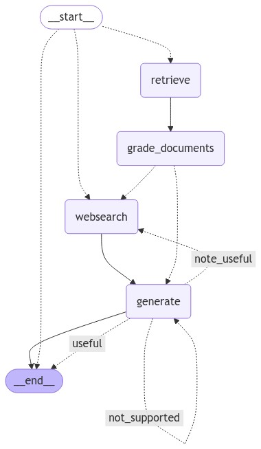

# Adaptive, Corrective and Self-Reflective RAG

This repository implements a Adaptive, Corrective and Self-Reflective Retrieval-Augmented Generation (RAG) pipeline that enhances the accuracy of generated answers. When a user asks a question, we perform adaptive routing to determine if the question should be answered by a vector store retrieval or by performing a web search. If vector store retrieval, relevant documents are retrieved from the QDrant Vector Store and graded for relevance. If necessary, the system performs a web search for additional context. If the model hallucinates or provides irrelevant answers, corrective loops trigger a new answer generation. The process continues until a useful and relevant response is generated, ensuring high-quality, accurate outputs that address the user's query.
